<div align="center">
  
</div>

```console
$ whoami
  WoldenMn — France

$ ls -a ~/workspace
  quelques entrées visibles. Le reste est masqué.

$ cat ./manifeste
  Windows desktop, assumé. Pas de cloud là où le local suffit.
  Rust quand ça doit tenir. TypeScript quand ça doit bouger.
  Python quand ça doit juste marcher demain matin.
  Un outil qui demande un mode d'emploi est un outil raté.
```

### Terrain

|                    |                                                              |
| ------------------ | ------------------------------------------------------------ |
| **Desktop**        | Tauri v2 · Rust · .NET 8 · plugins Stream Deck               |
| **Web**            | Next.js · React 19 · Tailwind                                |
| **Automatisation** | serveurs MCP · FastAPI · PowerShell · Docker                 |
| **Signal**         | ESP32 · pipelines audio/vidéo · OSINT                        |

<details>
<summary><b>Ce qui n'est pas ici</b></summary>

<br>

Les dépôts privés : outils de poste, applications desktop livrées, serveurs MCP,
bots, pipelines audio et vidéo. Rien d'abandonné. Le compte exact est dans la
bannière, qui le tient de l'API.

Ce compte n'est pas une vitrine. C'est un atelier fermé dont on aperçoit
la porte.

</details>

<details>
<summary><b>Transmission</b></summary>

<br>

Deux dépôts sont visibles. Celui-ci, dont le code génère la bannière que vous venez
de voir. Et [`rtk`](https://github.com/WoldenMn/rtk), un fork d'un proxy CLI qui
réduit la consommation de tokens des agents.

</details>

<div align="center">
  <sub><code>les compteurs de la bannière sont régénérés depuis l'API, jamais écrits à la main</code></sub>
</div>
